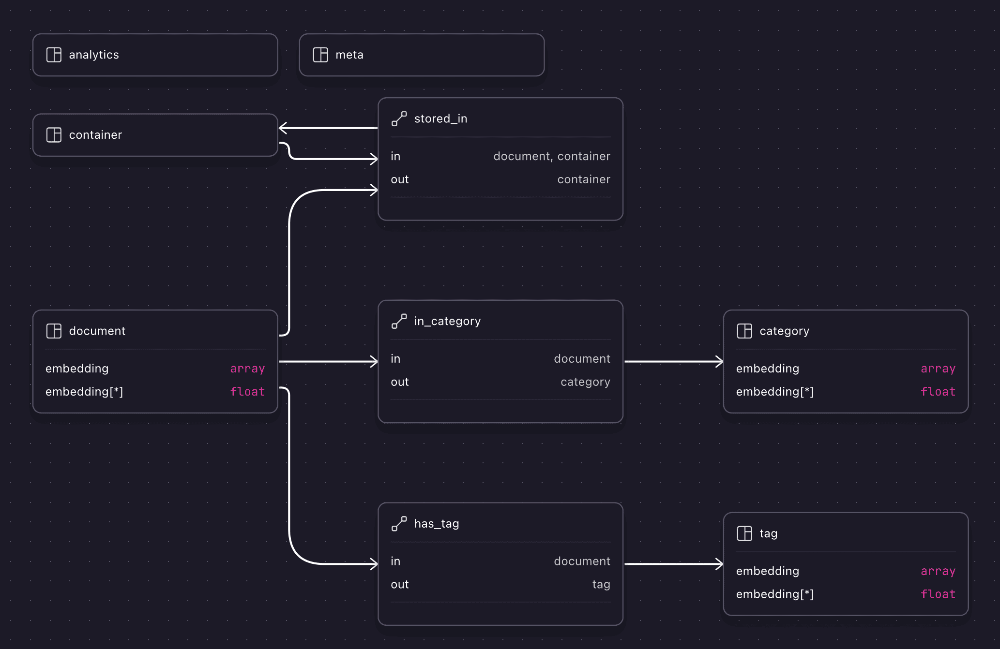
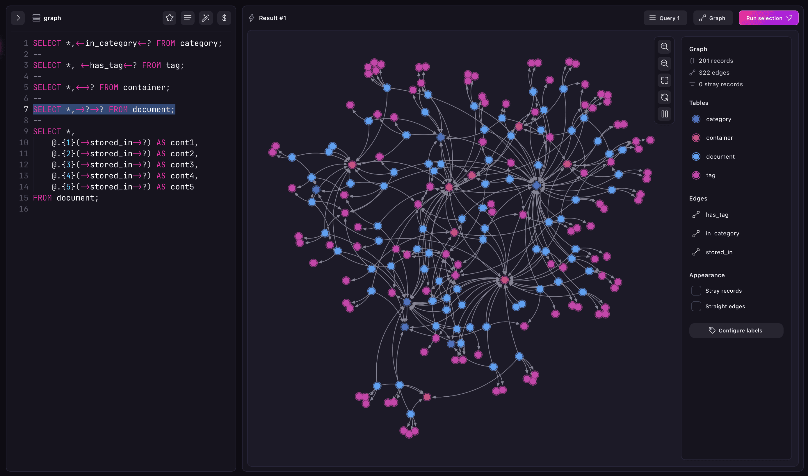

<p align="center">
  <a href="https://github.com/martinschaer/kaig">
    
  </a>
</p>

# Kai G

> /ˈkaɪ ˈdʒiː/ – Kai rhymes with sky, and G like the letter G.

Hi! Let me handle your DB needs for your AI project. If you need **vector search**,
or **graph queries**, I've got you covered. I use [SurrealDB](https://surrealdb.com)
under the hood, which is a multi-model DB that greatly simplifies your architecture.

## Getting started

```python
# Set up your vector indexes and graph relations
db = DB(
    "ws://localhost:8000/rpc",
    username,
    password,
    ns,
    db,
    Embedder("all-minilm:22m", "F32")
    LLM(),
    vector_tables=[
        VectorTableDefinition("document", "HNSW", "COSINE"),
        VectorTableDefinition("keyword", "HNSW", "COSINE"),
        VectorTableDefinition("category", "HNSW", "COSINE"),
    ],
    graph_relations=[
        Relation("has_keyword", "document", "keyword"),
        Relation("in_category", "document", "category"),
        Relation("stored_in", "document|container", "container"),
    ],
)
db.init_db()
```

This will generate a schema similar to this (which you can see in the Designer
tab of [Surrealist](https://surrealdb.com/surrealist)):



## Ingesting

This sample code inserts documents in the vector store, and creates a graph with
documents related to keywords.

```python
keywords: set[str] = set()
doc_to_keywords: dict[str, set[str]] = {}

for doc in documents:
    # This function generated the embeddings for the document
    db.embed_and_insert(doc)

    # Collect keywords
    keywords.update(doc.keywords)

    # Link documents with keywords
    if doc.id not in doc_to_keywords:
        doc_to_keywords[doc.id] = set()
    for keyword in doc.keywords:
        doc_to_keywords[doc.id].add(keyword)

# This function generates embeddings for the keywords (destination nodes)
db.add_graph_nodes_with_embeddings(
    src_table: "document",
    dest_table: "keyword",
    destinations: keywords,
    edge_name: "has_keyword",
    relations: doc_to_keywords
)
```

## Querying

```python
res, time = db.vector_search_from_text(
    Document,  # results are validated-against- and cast-to- this type
    "Dalinar Kholin",
    table="document",
    k=5,
    score_threshold=0.5,
    effort=40,
)
for x, score in res:
    print(f"• {score:.0%}: {x.content}")
print(f"Query took {time}ms")
```

## APIs

### kaig.db.DB

**Function** | **Description**
-|-
execute | run a surql query
async_execute | run a surql query asynchronously
insert_analytics_data | insert a record in the analytics table
safe_insert_error | insert a record in the errors table
error_exists | check if there’s an ingestion error related to a document id
get_document | get a documents by id
list_documents | get all documents (optional skip and limit)
async_insert_document | insert document asynchronously
intert_document | insert document
embed_and_insert | generate embedding and insert document
vector_search_from_text | generate embedding for query and execute a vector search with it
vector_search | execute a vector search with the provided embedding
async_vector_search | execute a vector search with the provided embedding asynchronously
relate | relate two nodes with a graph edge
add_graph_nodes | add nodes to the graph
add_graph_nodes_with_embeddings | generate embeddings for the nodes and insert them
recursive_graph_query | get all the children for a node
graph_query_inward | get all parent nodes
graph_siblings | get all nodes that share the same parent as the provided node

### kaig.llm.LLM

**Function** | **Description**
-|-
gen_name_from_desc | generate a name from a description
gen_answer | generate an answer from a question and a context
infer_attributes | use a pydantic BaseModel to have the LLM infer the attributes

## Next steps

- Take a look at the [packages](https://github.com/martinschaer/kaig/tree/main/packages) folder.
- Get familiar with SurrealQL:
  - [SurrealQL intro queries](./docs/surql-intro.surql)
  - [Official SurrealQL docs](https://surrealdb.com/docs/surrealql)

## Visualizing the graph

Using [Surrealist](https://surrealdb.com/surrealist)

Example query from all `document`s connected by any edge (`?`) to any other nodes (`?`):

```sql
SELECT *, ->?->? FROM document;
```


