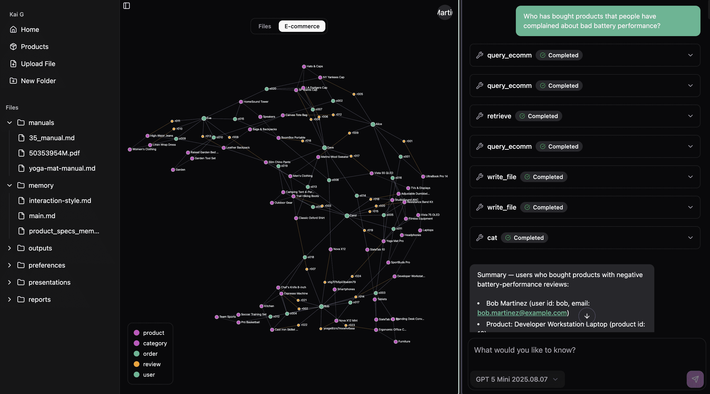
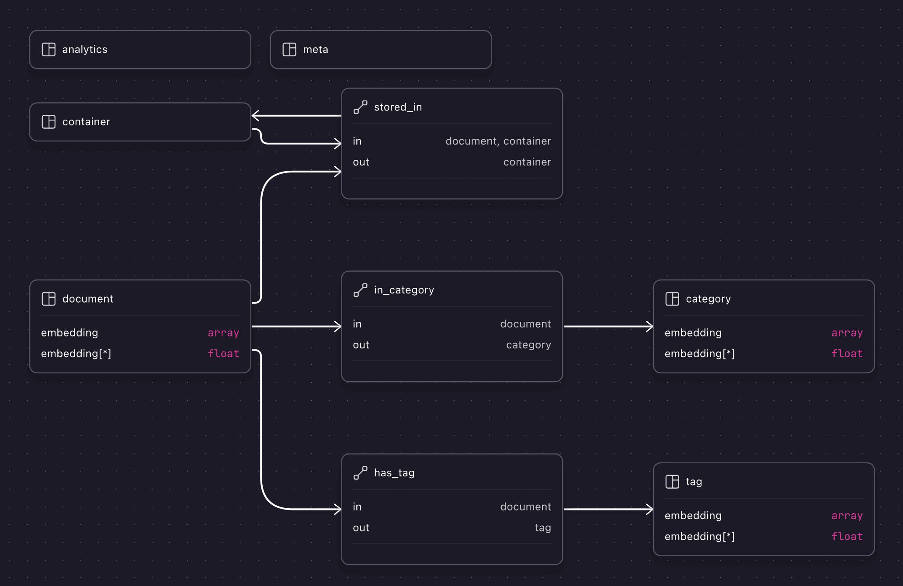
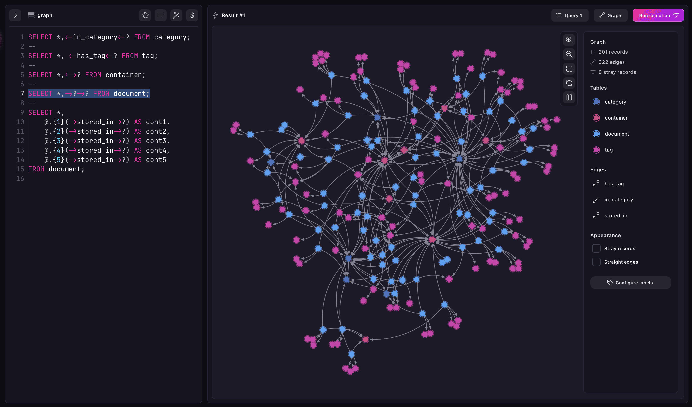

> [!IMPORTANT]
> This repo is experimental. Use it as an example to implement your own solutions, or clone and install it as a local dependency.



# Kai G

> /ˈkaɪ ˈdʒiː/ – Kai rhymes with sky, and G like the letter G.

Hi! Let me handle your DB needs for your AI project. If you need **vector search**,
or **graph queries**, I've got you covered. I use [SurrealDB](https://surrealdb.com)
under the hood, which is a multi-model DB that greatly simplifies your architecture.

If you are interested in **knowledge graphs**, take a look at my [knowledge-graph example](/examples/knowledge-graph).

## Kai G demo app

Find it in [kaig-app](/kaig-app).

Features:

- pydantic-ai [agent](/examples/knowledge-graph/agent.py) with agentic RAG and memory tools
- user authentication with [JWT tokens issued by the backend](/kaig-app/src/lib/server/auth.ts) (TS)
- [LIVE queries](/kaig-app/src/lib/components/app-sidebar.svelte) from the browser using JWT and [DEFINE ACCESS](/kaig-app/migrations/V3__record_access.surql).
- upload files from the app into SurrealDB
- a [worker](/examples/knowledge-graph/src/knowledge_graph/ingest.py) runs the ETL pipeline using [flow](/examples/knowledge-graph/src/knowledge_graph/flow)
- document parsing and chunking using [Kreuzberg](https://docs.kreuzberg.dev/integrations/surrealdb/)
- virtual file-system supported by the [file table](/kaig-app/migrations/V5__files.surql), and bash-like [fs tools](/examples/knowledge-graph/tools/fs.py) to interact with it
- [text-to-SurrealQL](/examples/knowledge-graph/tools/query_db.py). Examples: "Find all orders and customers related to tech products", "Create an interactive HTML file with all our 5-star reviews"

## Using Kai G utils

Create an instance:

```python
# Set up your vector indexes and graph relations
db = DB(
    "ws://localhost:8000/rpc",
    username,
    password,
    ns,
    db,
    Embedder(
        provider="ollama",
        model_name="all-minilm:22m",
        vector_type="F32"
    ),
    LLM("ollama", "llama3.2"),
    vector_tables=[
        VectorTableDefinition("document", "COSINE"),
        VectorTableDefinition("keyword", "COSINE"),
        VectorTableDefinition("category", "COSINE"),
    ],
    graph_relations=[
        Relation("has_keyword", "document", "keyword"),
        Relation("in_category", "document", "category"),
        Relation("stored_in", "document|container", "container"),
    ],
)
db.apply_schemas()
```

This will generate a schema similar to this (which you can see in the Designer
tab of [Surrealist](https://surrealdb.com/surrealist)):



### Loading embedded chunks, graph nodes and edges

This sample code loads documents in the vector store, and creates a graph with
documents related to keywords.

```python
keywords: set[str] = set()
doc_to_keywords: dict[str, set[str]] = {}

for doc in documents:
    # This function generated the embeddings for the document
    db.embed_and_insert(doc)

    # Collect keywords
    keywords.update(doc.keywords)

    # Link documents with keywords
    if doc.id not in doc_to_keywords:
        doc_to_keywords[doc.id] = set()
    for keyword in doc.keywords:
        doc_to_keywords[doc.id].add(keyword)

# This function generates embeddings for the keywords (destination nodes)
db.add_graph_nodes_with_embeddings(
    src_table: "document",
    dest_table: "keyword",
    edge_name: "has_keyword",
    relations: doc_to_keywords
)
```

### Querying

```python
res, time = db.vector_search_from_text(
    Document,  # results are validated-against- and cast-to- this type
    "Dalinar Kholin",
    table="document",
    k=5,
    score_threshold=0.5,
    effort=40,
)
for x, score in res:
    print(f"• {score:.0%}: {x.content}")
print(f"Query took {time}ms")
```

## API Reference

### kaig.db.DB

**Setup functions** | **Description**
-|-
apply_schemas | initialize DB schema/indexes (vector tables, graph relations, analytics/docs tables)
clear | drop tables/indexes created/used by this instance
file_table | name of the files table
async_conn | get an authenticated async connection (lazy)
sync_conn | get an authenticated sync connection (lazy)

**Data functions** | **Description**
-|-
execute | run a SurrealQL query loaded from a `.surql` file (sync)
async_execute | run a SurrealQL query loaded from a `.surql` file (async)
query | query a list of records and validate them as the expected type
query_one | query a single record and validate it as the expected type
count | count how many records match a query (optionally grouped)
exists | check if a record exists by record id
insert_analytics_data | insert a record in the analytics table
safe_insert_error | insert a record in the errors table (async, best-effort)
error_exists | check if an error record exists for a given id (async)
store_original_document | store an original file (as bytes) and dedupe by hash
store_original_document_from_bytes | store an original file from bytes and dedupe by hash
get_document | get a document/chunk by id (async)
list_documents | list documents/chunks with pagination (async)
async_insert_document | insert a document/chunk asynchronously
insert_document | insert a document/chunk synchronously
embed_and_insert | generate an embedding (if needed) and insert the document/chunk
embed_and_insert_batch | generate embeddings and insert documents/chunks in batch
vector_search_from_text | embed query text and run a vector search
vector_search | run a vector search with a provided embedding
async_vector_search | run a vector search with a provided embedding (async)
relate | create graph edges between records
add_graph_nodes | upsert destination nodes and relate them
add_graph_nodes_with_embeddings | embed + upsert destination nodes and relate them
recursive_graph_query | fetch children recursively up to N levels
graph_query_inward | fetch parent nodes (optionally using an embedding for ranking)
graph_siblings | fetch nodes that share the same parent

### kaig.llm.LLM

**Function** | **Description**
-|-
gen_name_from_desc | generates a short name for an item given a description
gen_answer | generates an answer from a question and a context
gen_surql | text-to-SurrealQL
infer_attributes | uses a pydantic BaseModel to have the LLM infer the attributes
infer_concepts | generates a list of concepts that can be used to describe a provided text
summarize | generates a description of what the text is about in 1 or 2 sentences
sentiment | infers the sentiment of a text (positive, neutral, negative)

## Next steps

- Take a look at the [packages](https://github.com/martinschaer/kaig/tree/main/packages) folder.
- Get familiar with SurrealQL:
  - [SurrealQL intro queries](./docs/surql-intro.surql)
  - [Official SurrealQL docs](https://surrealdb.com/docs/surrealql)

## Visualizing the graph

Using [Surrealist](https://surrealdb.com/surrealist)

Example query from –and to– all `document`s connected by any edge (`?`) to any other nodes (`?`):

```sql
SELECT *, <->?<->? FROM document;
```


