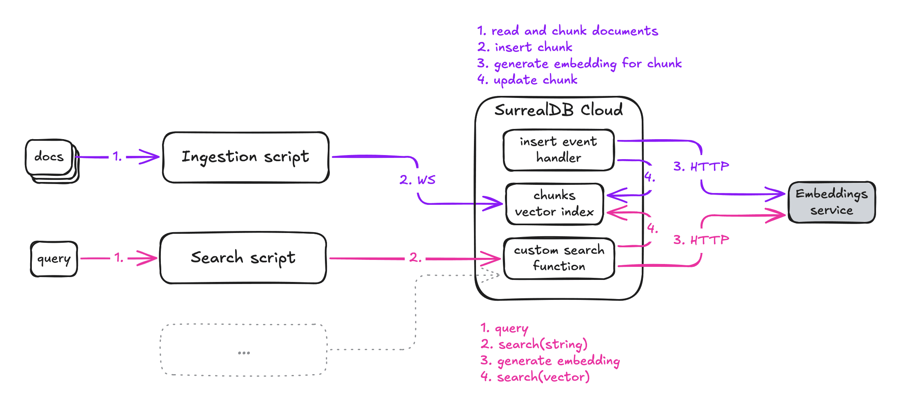

# Kai G demo server

This server provides an embedding service that can be used in an event-driven
architecture like this:



## Running locally

**DB**

```sh
docker-compose up -d
```

**Server**

Requirements:
- [cargo](https://rustup.rs/): run/build embedding service
- [ollama](https://ollama.com/): local models

```sh
# pull the model (you only need to do this the first time)
ollama pull all-minilm:22m

RUST_LOG=debug cargo run -- --embeddings-model all-minilm:22m --llm-model llama3.2:latest
```

**Ingestion**

TODO: create the index

**Search**

```sh
curl -X POST -u "root:root" \
    -H "Surreal-NS: kaig-demo" \
    -H "Surreal-DB: main" \
    --json '{"table": "documents", "text": "hello world", "threshold": 0.55}' \
    http://127.0.0.1:8000/api/kaig-demo/main/search-text
```

If you have [`jq`](https://jqlang.org/) installed, pipe `| jq` at the end to format the result.

Example response:

```json
{
  "response": [
    {
      "score": 0.6576561471352887,
      "content": "Lorem ipsum"
    }
  ]
}
```

## Building

```sh
cargo build --release
```

Then run with:

```sh
./target/release/kaig-demo --ollama-model all-minilm:22m
```

Tunnel with ngrok for testing the cloud DB with a local kaig-demo:

```sh
ngrok http --url=your-static-ngrok-domain.ngrok-free.app 8080
```
